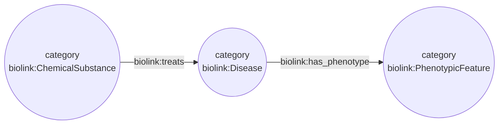
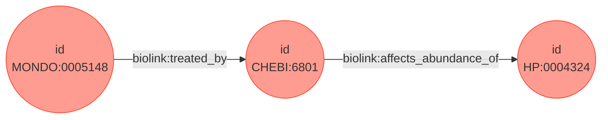

# Execution Overview

This document is intended to give the reader a brief overview of the steps that Strider takes to execute a query. All of this information could be found by reading the code, but a high level overview can be a valuable learning tool. 

This document includes some graphs written with the [mermaid syntax](https://mermaid-js.github.io/mermaid/#/). For the best experience, please activate the Github+Mermaid extension for either [Chrome](https://chrome.google.com/webstore/detail/github-%20-mermaid/goiiopgdnkogdbjmncgedmgpoajilohe?hl=en), [Firefox](https://addons.mozilla.org/en-US/firefox/addon/github-mermaid/?src=recommended), or [VS Code](https://marketplace.visualstudio.com/items?itemName=bierner.markdown-mermaid).

## Preprocessing

Queries come in either through the `/asyncquery` or `/query` endpoints, defined in [server.py](strider/server.py). When queries come in they are validated by the FastAPI route. This ensures that the query graph is present and formatted correctly.

The setup method contains some logic for standardizing the query graph beyond what is done by FastAPI. For example, categories are not required on query graph nodes so missing categories are filled in with default values. 

Another standardization step is handling prefixes. Multiple identifiers (IDs) can refer to the same item with different prefixes. For example, `NCIT:C25742` and `UMLS:C0032961` both refer to the concept of pregnancy. Strider would like to be able to combine these identifiers so internally it contains a list of "preferred" prefixes so that we can choose which identifiers we would like to have. Preferred prefixes come from the biolink model, which contains an ordered list for each category. During the setup method we convert the query graph identifiers to the preferred prefixes. This is done by contacting the node normalization service.

## Execution

After planning, query execution is handled by the StriderWorker (fetcher). The StriderWorker is a wrapper around a priority queue which holds results object. The motivation for this architecture is to be able to return results before the query has finished execution. In this case you can think of a completed result as a binding of all nodes to IDs:

#### Example Query Graph:

#### Example completed result:

Notice that the result matches the query graph, but has all of the unbound nodes converted to bound nodes.

When contacting KPs we combine the information in the plan with the current ID to create a new message that is sent to the KP. This is done in the `get_kp_request_body` function. Before sending to the KP we also go through the prefix conversion process. KPs include a set of preferred ID prefixes that may not be the same as Strider's. We use the preferred prefixes of the KP to convert IDs before sending the request.

We also convert the results from the KP to Strider's preferred prefixes. This is not just for the query graph but for the knowledge graph and results list. The utilities that are used to do this can be found in the [trapi.py](strider/trapi.py) file.

After receiving and converting KP results we merge the existing results with new ones. We do our best to combine results that have matching information. The utilities for this are also in the trapi.py file. Knowledge graph nodes are combined based on the ID, and knowledge graph edges are combined if they have the same subject/predicate/object triple. Combining these results perfectly is still an active area of development so the existing implementation can be seen as a sort of heuristic.
