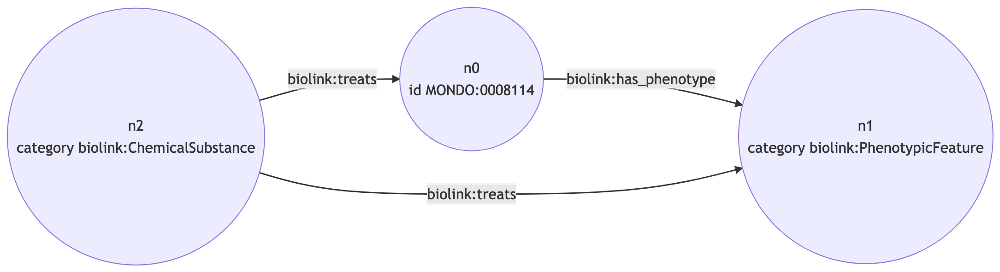

# Query Planning

This document provides an overview of how query planning works. Query planning is very complex. The best way to understand query planning in Strider is to use this document in conjunction with the [test_query_planner.py](tests/test_query_planner.py) file and the source code in [query_planner.py](strider/query_planner.py). 


## What is a plan?

Before a query can be executed, a plan needs to be created. This plan describes which edges will be traversed in what order and what KPs will be contacted for each edge. Here is an example of a looped query graph and associated plan:



```json
{
    "n0-n0n1-n1": [{
        "name": "kp3",
        "url": "http://kp3",
        "edge_predicate": "-biolink:has_phenotype->",
        "source_category": "biolink:Disease",
        "target_category": "biolink:PhenotypicFeature",
        "reverse": false
    }],
    "n1-n2n1-n2": [{
        "name": "kp2",
        "url": "http://kp2",
        "edge_predicate": "<-biolink:treats-",
        "source_category": "biolink:PhenotypicFeature",
        "target_category": "biolink:ChemicalSubstance",
        "reverse": true
    }],
    "n2-n2n0-n0": [{
        "name": "kp1",
        "url": "http://kp1",
        "edge_predicate": "-biolink:treats->",
        "source_category": "biolink:ChemicalSubstance",
        "target_category": "biolink:Disease",
        "reverse": false
    }]
}
```

Things to notice about the plan:

* Keys in the plan are subject, edge, object. This is necessary because we are allowed to traverse edges in either the forward or backwards direction. In this case, we could traverse edge n1n2 in the reverse direction by changing the predicate from `biolink:treats` to `biolink:treated_by`. 
* The plan always starts from a pinned node (one with an ID). This is because we have to send an ID to the KPs.
* The KP list associated with each edge in the plan includes categories and predicates. This is because we are allowed to change the predicate when contacting a KP. For example, if there is a KP that accepts `positively_correlated_with` as the predicate we can convert `correlated_with` to `positively_correlated_with` when we contact it. 

## Plan creation

To facilitate query planning the first thing we do is generate an operation graph. An operation is defined as a source, predicate, category triple. This isn't the same as an edge in the query graph because edges can be traversed in multiple directions and also sometimes with different predicates. A simple example would be an edge that has the predicate `biolink:treats` would be expanded to include an edge in the reverse direction with `biolink:treated_by`.

The next step is adding descendants to the operation graph. When we receive a query graph with a category `biolink:MolecularEntity` we assume that this node is also allowed to be any subclass of `biolink:MolecularEntity` including `biolink:ChemicalSubstance` and `biolink:Protein`. 

After creating the operation graph we use the KP registry to look for KPs that satisfy each edge. The KP registry provides a `/search` endpoint that takes in triples (`biolink:ChemicalSubstance-biolink:treats->biolink:Disease`) and returns KPs that can provide this information. These are added to the operation graph during a process we call annotation. Here is an example of an annotated operation graph during planning:

```json
{
    "nodes": {
        "n0": {
            "category": ["biolink:MolecularEntity", "biolink:Food", "biolink:GeneFamily"...]
        },
        "n1": {
            "id": ["MONDO:0005148"],
            "category": ["biolink:Disease"]
        },
        "n2": {
            "category": ["biolink:GeneOrGeneProduct", "biolink:GeneProductMixin", "biolink:GeneProductIsoformMixin"]
        }
    },
    "edges": {
        "n1n0": {
            "qg_edge_id": "n1n0",
            "edge_reverse": false,
            "source": "n1",
            "target": "n0",
            "predicate": ["-biolink:treated_by->", "-biolink:approved_for_treatment_by->"],
            "kps": [{
                "name": "kp0",
                "url": "http://kp0",
                "edge_predicate": "-biolink:treated_by->",
                "source_category": "biolink:Disease",
                "target_category": "biolink:Drug"
            }, {
                "name": "kp3",
                "url": "http://kp3",
                "edge_predicate": "-biolink:treated_by->",
                "source_category": "biolink:Disease",
                "target_category": "biolink:MolecularEntity"
            }]
        },
        "n0n2": {
            "qg_edge_id": "n0n2",
            "edge_reverse": false,
            "source": "n0",
            "target": "n2",
            "predicate": ["-biolink:affects_abundance_of->", "-biolink:decreases_abundance_of->", "-biolink:increases_abundance_of->"],
            "kps": [{
                "name": "kp2",
                "url": "http://kp2",
                "edge_predicate": "-biolink:decreases_abundance_of->",
                "source_category": "biolink:MolecularEntity",
                "target_category": "biolink:GeneOrGeneProduct"
            }]
        }
    }
}
```

We then copy these KPs back over to the query graph. At this point, we may have incompatible KPs attached to edges. For example, in the annotated operation graph we have `kp0` attached to `n1n0` which has the signature `Disease-treated_by->Drug`. This KP is incompatible with kp2 which has the signature `MolecularEntity-decreases_abundance_of->GeneOrGeneProduct` because a MolecularEntity is not necessarily a Drug. To solve this issue we generate permutations of the query graph. This involves simply testing every combination of KPs for validitiy. In the small example above we would test kp0 with kp2, and kp3 with kp2.

TODO finish this description
